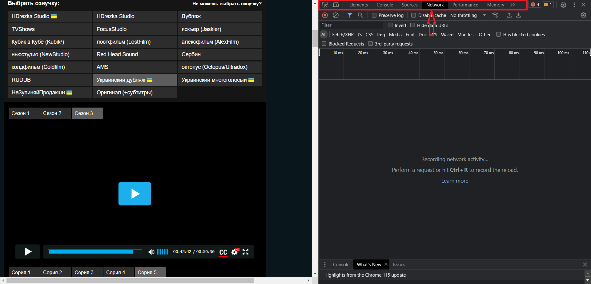
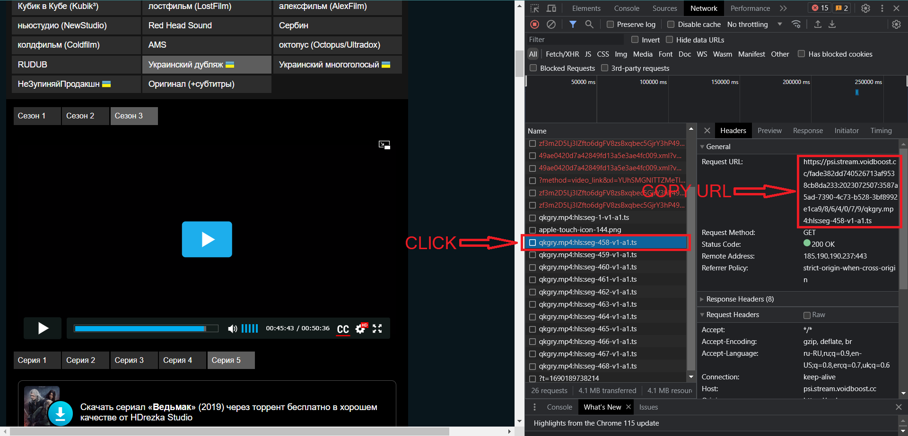
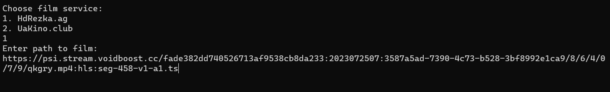

# film-downloader
# How it work
## 1. Choose film service like HdRezka or UaKino.club.
## 2. Choose film on service.
## 3. Press F12 on page with film and choose Network

## 4. Start playing a film
## 5. Search in list requests link to film destination and click him like this:

## 6. Open film-downloader application and input data 

## 7. Press Enter to downloading, film has been saved about application folder